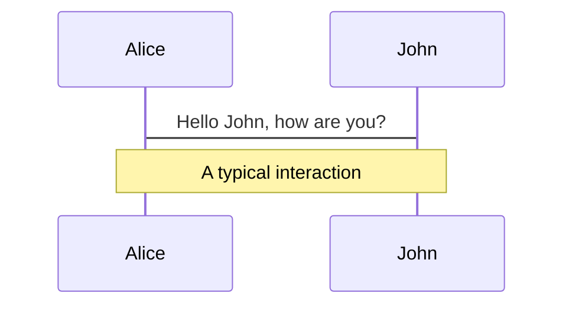
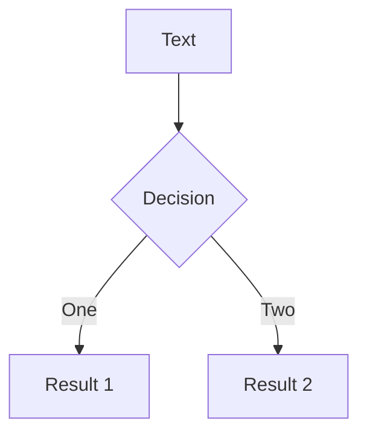
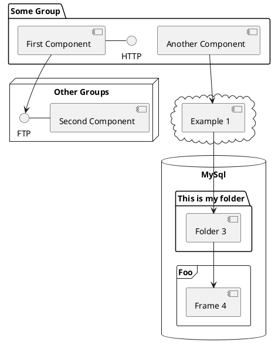

---
# try also 'default' to start simple
theme: seriph
# random image from a curated Unsplash collection by Anthony
# like them? see https://unsplash.com/collections/94734566/slidev
background: https://source.unsplash.com/collection/94734566/1920x1080
# apply any windi css classes to the current slide
class: 'text-center'
# https://sli.dev/custom/highlighters.html
highlighter: shiki
# show line numbers in code blocks
lineNumbers: false
# some information about the slides, markdown enabled
info: |
  ## Slidev Starter Template
  Presentation slides for developers.

  Learn more at [Sli.dev](https://sli.dev)
# persist drawings in exports and build
drawings:
  persist: false
---

# Ansible 介绍

BBFE-武汉 李聪


---

# Ansible 是什么?

Ansible 是一个 python 语言编写的 IT 自动化工具.
-  **Agentless** - Ansible 管理目标机器，并不需要 agent 部署再目标机器上
-  **Python** - Ansible 管理服务器，只需要目标机器上安装 python 2.4+ 
-  **SSH** - Ansible 和目标机器之间使用 SSH 协议通讯
-  **Fast** - Ansible 可以同时管理成百上千台服务器
-  **Scalable** - Ansible 是插件化的，编写插件也非常简单
<br>
<br>

Read more about [Ansible?](https://www.ansible.com/)


---

# 安装
Ansible 是 Python 编写的一个包，我们可以使用 pip 安装 Ansible.
> Ansible 能管理 windows , 但是 Ansible本身 不能运行再 Windows 上，Ansible 能运行再 Windows 的 WSL 里面。
```
pip install ansible
```
```
vagrant@archlinux ~ $ ansible --version
ansible [core 2.12.4]
  config file = /etc/ansible/ansible.cfg
  configured module search path = ['/home/vagrant/.ansible/plugins/modules', '/usr/share/ansible/plugins/modules']
  ansible python module location = /usr/lib/python3.10/site-packages/ansible
  ansible collection location = /home/vagrant/.ansible/collections:/usr/share/ansible/collections
  executable location = /usr/bin/ansible
  python version = 3.10.4 (main, Mar 23 2022, 23:05:40) [GCC 11.2.0]
  jinja version = 3.0.3
  libyaml = True
```
安装成功以后，系统中会加入一系列 ansible 开头的命令 ansible-* 。
---

# Ansible 命令基本用法
ansible <主机>   <模块>   -a   <模块参数>
```
vagrant@archlinux ~ $ ansible localhost -m shell -a "date"
[WARNING]: No inventory was parsed, only implicit localhost is available
localhost | CHANGED | rc=0 >>
Mon Apr 18 08:19:47 AM UTC 2022
vagrant@archlinux ~ $ ansible localhost -m shell -a "pwd"
[WARNING]: No inventory was parsed, only implicit localhost is available
localhost | CHANGED | rc=0 >>
/home/vagrant
```
Ansible 的默认模块是 command 模块
```
vagrant@archlinux ~ $ ansible localhost -a "pwd"
[WARNING]: No inventory was parsed, only implicit localhost is available
localhost | CHANGED | rc=0 >>
/home/vagrant
```

---

# 名词解释
Ansible 不仅 ansible 命令那么简单，要使用好 Ansible , 还需要了解一些概念。
|     |     |
| --- | --- |
| Inventory | 记录被管理主机的文件 |
| Taks      | Ansible 执行的任务  |
| Playbooks | Ansible 脚本，Yaml 格式或者 JSON 格式,包含一系列的 Task |
| Roles | 一系列 playbook 的组合 |
| Ansible-galaxy | Ansible Role 的管理工具，可以共享，下载 Roles |

---

# Inventory
Inventory 是一个类似 ini 格式的文件，它可以对服务器进行分组
```
mail.example.com

[dbservers]
one.example.com
two.example.com
three.example.com
```
更加完整的文件如下, 跟多参数可以参考 [Ansible Doc](https://docs.ansible.com/ansible/2.3/intro_inventory.html#list-of-behavioral-inventory-parameters)
```
mail.example.com ansible_ssh_port=22 ansible_ssh_host=mail.example.com ansible_ssh_user=root ansible_ssh_private_key_file=password

[dbservers]
one.example.com ansible_ssh_port=22 ansible_ssh_host=mail.example.com ansible_ssh_user=root ansible_ssh_private_key_file=password
two.example.com ansible_ssh_port=22 ansible_ssh_host=mail.example.com ansible_ssh_user=root ansible_ssh_private_key_file=password
three.example.com ansible_ssh_port=22 ansible_ssh_host=mail.example.com ansible_ssh_user=root ansible_ssh_private_key_file=password
```

> 如果需要使用账号密码进行 SSH 认证，需要控制机器上安装 sshpass 命令。

---

# Playbook

Ansible 的 playbook 是一个 Yaml 或者 JSON 语言编写的脚本。大致如下格式:
```yaml
---
- hosts: webservers
  vars:
    http_port: 80
  remote_user: root
  tasks:
  - name: ensure apache is at the latest version
    yum: name=httpd state=latest
  - name: write the apache config file
    template: src=/srv/httpd.j2 dest=/etc/httpd.conf
    notify:
    - restart apache
  - name: ensure apache is running (and enable it at boot)
    service: name=httpd state=started enabled=yes
  handlers:
    - name: restart apache
      service: name=httpd state=restarted
```
执行
```
ansible-playbook -i inventory palybook.yaml
```
---

# Themes

Slidev comes with powerful theming support. Themes can provide styles, layouts, components, or even configurations for tools. Switching between themes by just **one edit** in your frontmatter:

<div grid="~ cols-2 gap-2" m="-t-2">

```yaml
---
theme: default
---
```

```yaml
---
theme: seriph
---
```


</div>

Read more about [How to use a theme](https://sli.dev/themes/use.html) and
check out the [Awesome Themes Gallery](https://sli.dev/themes/gallery.html).

---
preload: false
---

# Animations

Animations are powered by [@vueuse/motion](https://motion.vueuse.org/).

```html
<div
  v-motion
  :initial="{ x: -80 }"
  :enter="{ x: 0 }">
  Slidev
</div>
```

<div class="w-60 relative mt-6">
  <div class="relative w-40 h-40">
    
    
    
  </div>

  <div
    class="text-5xl absolute top-14 left-40 text-[#2B90B6] -z-1"
    v-motion
    :initial="{ x: -80, opacity: 0}"
    :enter="{ x: 0, opacity: 1, transition: { delay: 2000, duration: 1000 } }">
    Slidev
  </div>
</div>

<!-- vue script setup scripts can be directly used in markdown, and will only affects current page -->
<script setup lang="ts">
const final = {
  x: 0,
  y: 0,
  rotate: 0,
  scale: 1,
  transition: {
    type: 'spring',
    damping: 10,
    stiffness: 20,
    mass: 2
  }
}
</script>

<div
  v-motion
  :initial="{ x:35, y: 40, opacity: 0}"
  :enter="{ y: 0, opacity: 1, transition: { delay: 3500 } }">

[Learn More](https://sli.dev/guide/animations.html#motion)

</div>

---

# LaTeX

LaTeX is supported out-of-box powered by [KaTeX](https://katex.org/).

<br>

Inline $\sqrt{3x-1}+(1+x)^2$

Block
$$
\begin{array}{c}

\nabla \times \vec{\mathbf{B}} -\, \frac1c\, \frac{\partial\vec{\mathbf{E}}}{\partial t} &
= \frac{4\pi}{c}\vec{\mathbf{j}}    \nabla \cdot \vec{\mathbf{E}} & = 4 \pi \rho \\

\nabla \times \vec{\mathbf{E}}\, +\, \frac1c\, \frac{\partial\vec{\mathbf{B}}}{\partial t} & = \vec{\mathbf{0}} \\

\nabla \cdot \vec{\mathbf{B}} & = 0

\end{array}
$$

<br>

[Learn more](https://sli.dev/guide/syntax#latex)

---

# Diagrams

You can create diagrams / graphs from textual descriptions, directly in your Markdown.

<div class="grid grid-cols-3 gap-10 pt-4 -mb-6">







</div>

[Learn More](https://sli.dev/guide/syntax.html#diagrams)


---
layout: center
class: text-center
---

# Learn More

[Documentations](https://sli.dev) · [GitHub](https://github.com/slidevjs/slidev) · [Showcases](https://sli.dev/showcases.html)
